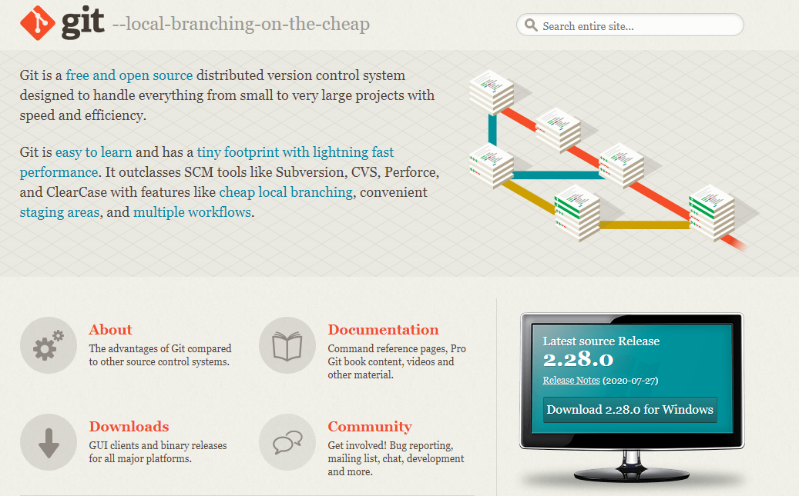

# LatihanVCS
Dibuat untuk memenuhi tugas Pertemuan ke-4 Bahasa Pemrograman

NAMA :AGUSTIN AFAREL

NIM:312010081

KELAS:TI.20.B1.

MATKUL:BAHASA PEMROGRAMAN

## Langkah langkah penggunaan git

* Download git dahulu, dengan link berikut ini : [click here](https://git-scm.com)

* Setelah file terdownload, lakukan instalisasi dengan referensi berikut ini :(https://git-scm.com/book/en/v2/Getting-Started-Installing-Git)

* Setelah instalisasi ,buka software GitBush pada menu Windows,lakukan pengecekan versi, dengan menetik syntax berikut:[git instalation guide]
>git--version

