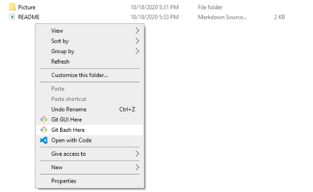
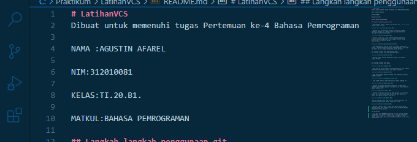
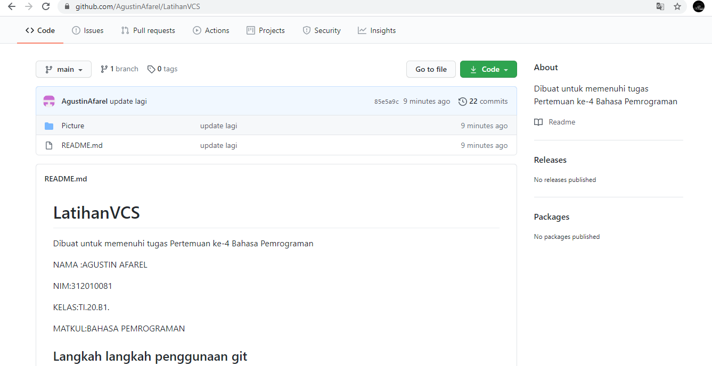

# LatihanVCS
Dibuat untuk memenuhi tugas Pertemuan ke-4 Bahasa Pemrograman

NAMA :AGUSTIN AFAREL

NIM:312010081

KELAS:TI.20.B1.

MATKUL:BAHASA PEMROGRAMAN

## Langkah langkah penggunaan git

* Download git dahulu, dengan link berikut ini : [click here](https://git-scm.com)

* Setelah file terdownload, lakukan instalisasi dengan referensi berikut ini :(https://git-scm.com/book/en/v2/Getting-Started-Installing-Git)

* Setelah instalisasi ,buka software GitBush pada menu Windows,lakukan pengecekan versi, dengan menetik syntax berikut:[git instalation guide]
>git--version

* Jika tampilan git version muncul, git sudah berhasil di instal, langkah pertama kita harus mengkonfigurasi user name dan email di Git, dengan mengetikan syntax berikut:

git config --global user.name"Masukan Nama"
git config --global user.email"Masukan Email"

* Setelah dibuat lakukan pengecekan dengan cara menulis syntax berikut:

git config --global user.name
git config --global user.email

* Buat akun di github seperti contoh dibawah ini. Dan lakukan verefikasi akun melalui email yang sudah terdaftar.

* Jika github sudah dibuat silahkan buat Repository seperti gambaar dibawah:

* Jika sudah berhasil maka akan muncul gambar dibawah ini:

* Setelah itu lakukan me-remote repository  Github pada GitBash Lokal dengan menyalin link URL git di Github seperti gambar dibawah ini:

* Setelah itu buka file explorer pada windows, pilih folder dimana kita akan mendownload repositroey dari Github ke lokal, klik kanan pilih Git bash here.

*Pop Up Commond Prompt akan terbuka. lakukan download file repository yang dibuat dengan syntax git clone.

* Setelah cloning slesai, folder awal master harus masuk kedalam folder yang telah dicloning yaitu LatihanVCS dengan mengetikan syntax berikut:

cd LatihanVCS/

* Lalu edit file README.md yang ada di file explorer dengan menggunakan Texk Editor (Sublime Text, Notepad, Notepad++, Visual studio code) edit sesuai dengan keinginan aturan file .md(Markdown) seperti gambar dibawah ini:

* Setelah file README.md diedit, simpan file dengan cara CTRL+S atau File-> Save

* Lalu ketik pada git bash dengan syntax
> git add

> git commit "update README.md"

> git push

*lalu cek hasil di github

 

